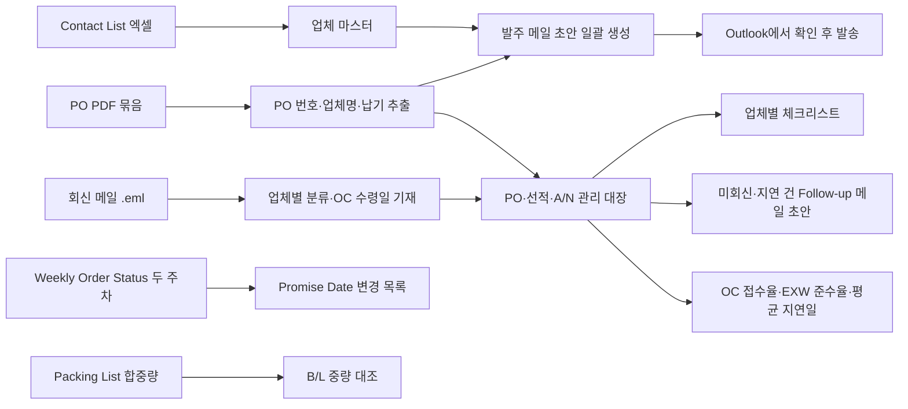
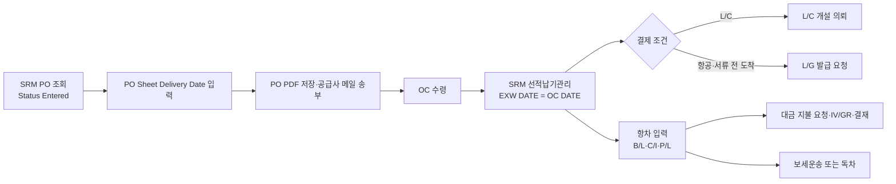

# 외자재 운영관리 Agent — 프로젝트 기획서

| 항목 | 내용 |
|---|---|
| 리포 | data09-12 |
| 제출자 | 김세이 |
| 직무·소속 | 생산관리팀 외자재 운영 — 해외 공급업체 대상 발주(PO), 납기 관리, A/N 및 선적서류 관리, 커뮤니케이션 업무 |
| 과정 | 현장 데이터 디지털화 전문가과정 1차수 |
| 작성일 | 2026-09-28 (v0.3·v0.4·v0.5·v0.6: 2026-09-29, v0.7: 2026-09-30) |
| 문서 상태 | 초안 v0.7 — 2026-09-30 패들릿 답변 반영(11.9: TMS NO = HIPRO 신청번호 확정, Incoterms·컨테이너 형식 비교 불필요 확정, SRM = HBL 기준 확정, A/N 은 도착 며칠 전 수신 확정). 이전: v0.6 — 2026-09-29 밤 실물 A/N 양식(해상 엑셀·B/L PDF·항공 메일)과 요청(B/L 별 항차등록·TMS NO·해상/항공 구분 불필요) 반영(11.8). 이전: v0.5 — 2026-09-29 메일 추가 자료(항차 매뉴얼·실물 PO·OC 회신·Cummins 주간 현황)와 추가 요청(2: Cummins Promise Date → EXW DATE), 같은 날 오후 늦게 받은 답변(11.6), 저녁 새 요청(11.7: 도착 통지 A/N 탭) 반영 |

---

## 1. 추진 배경과 현안

외자재 운영 담당자는 해외 공급업체를 상대로 발주(PO) 발송, 납기 관리, A/N(도착 통지, Arrival Notice — 가정: 원문 약어의 일반적 의미) 및 선적서류 관리, 업체 커뮤니케이션을 함께 수행합니다.

제출 원문에 적힌 현안은 다음 다섯 가지를 한 번에 해결하는 것입니다.

1. 업체별 연락처 자동 조회
2. PO 일괄 발송
3. A/N 자동 관리
4. 업체별 체크리스트 제공
5. Follow-up 메일 자동 생성

2026-09-28 추가 댓글에서 실제 업무 흐름과 요구가 더 구체적으로 제시되었습니다.

- 업무 흐름: **PO(.pdf) 발행 → 공급사 송부 → OC(Order Confirmation) 회신 확인(누락 방지) → EXW DATE 관리**
- 발주 메일을 보낸 뒤 공급사 회신 메일을 받은 일자를 **OC 일자로 기재하고 수령 여부를 관리**합니다. 현재는 HD360 페이지에서 EXW DATE와 OC 접수율을 확인하고 있습니다.
- **OC 미접수 건 팔로우업 작업의 자동화**가 필요합니다.
- **업체별 메일 분류** 작업을 요청했습니다.
- **Cummins Weekly Order Status 엑셀**에서 Promise Date가 바뀐 건을 확인해야 합니다.
- **Packing List의 자재 합중량과 B/L 중량이 일치하는지** 확인해야 합니다.
- EXW 준수율(%)과 평균 지연일을 보이게 하는 요구도 함께 전달되었습니다(패들릿 원문에서는 문구가 확인되지 않아 수강생 확인이 필요합니다).

제출 원문의 기대 산출물에 「선적일정 누락 방지」「업체별 관리 표준화」「담당자 변경 시 업무 연속성 확보」가 적혀 있으므로, 현재는 다음 어려움이 있다고 봅니다(가정).

- 업체 연락처·PO·메일이 엑셀, PDF, Outlook에 흩어져 있어 발주 때마다 찾아 맞추는 시간이 듭니다.
- 선적 일정과 A/N 수신 여부를 사람이 기억하거나 메일함에서 확인해야 해 누락이 생길 수 있습니다.
- 업체마다 챙겨야 할 항목이 담당자 머릿속에 있어, 담당자가 바뀌면 이어받기 어렵습니다.

## 2. 목표

### 2.1 최종 목표 (제출 원문 기준)

- 발주 업무시간 80% 이상 단축
- 선적일정 누락 방지
- 업체별 관리 표준화
- 담당자 변경 시 업무 연속성 확보

### 2.2 1차 개발 목표

- 공급업체 Contact List 엑셀과 PO PDF 묶음을 브라우저에 올리면, **PO마다 업체를 찾아 수신자·참조·제목·본문이 채워진 발주 메일 초안을 일괄로 만들어 주는 도구**를 먼저 만듭니다. 담당자는 초안을 Outlook에서 열어 확인한 뒤 보냅니다(자동 발송은 하지 않음).
- 같은 화면에 PO별 송부일·OC 수령일·EXW DATE·선적·A/N 진행 상태를 기록하는 **관리 대장**을 두어, OC 미접수와 선적 누락을 한눈에 봅니다.
- OC 미접수 건 팔로우업 메일 초안, EXW 준수율·평균 지연일, Weekly Order Status의 Promise Date 변경 검출, Packing List 합중량과 B/L 중량 대조를 같은 도구 안에서 처리합니다.

## 3. 보유 데이터

| 데이터 | 형태 | 규모·주기 | 비고(민감도 등) |
|---|---|---|---|
| 공급업체 Contact List 정리본 | Excel | 업체 수·열 구성 미상(샘플 필요) | 업체 담당자 이름·이메일·전화 — 개인정보 포함 |
| 구매발주서(PO) | PDF | 발주 건마다 발생, 발행 주기·월 건수 미상 | 단가·수량·품번 등 거래 조건 — 영업 비밀 |
| 업무 메일 | Outlook 메일 | 업체 커뮤니케이션, A/N·선적서류 수신 포함(가정) | 거래처 정보 포함 — 민감 |
| A/N·선적서류 | 메일 첨부로 수신(가정), 형태 미상 | 선적 건마다 | 확인 필요 |
| OC(Order Confirmation) 회신 메일 | Outlook 메일 | PO 송부 건마다 | 회신 수신일을 OC 일자로 기재 |
| HD360 페이지의 EXW DATE·OC 접수율 | 사내(또는 포털) 웹 화면 — 내려받기 가능 여부 미상 | 수시 확인 | 확인 필요 |
| Cummins Weekly Order Status | Excel | 주간(파일명 기준, 가정) | 열 구성 미상 — PO·품번·Promise Date 포함(가정) |
| Packing List | 형태 미상(Excel 또는 PDF, 가정) | 선적 건마다 | 자재별 중량 포함 |
| B/L(선하증권) | 형태 미상(PDF, 가정) | 선적 건마다 | 총중량 기재 |

제출 원문에 첨부 파일은 없습니다. 실제 열 이름·양식은 샘플을 받은 뒤 확정합니다(10장).

## 4. 해결 방안 개요

| 단계 | 내용 |
|---|---|
| 수집 | Contact List 엑셀, PO PDF, (확장) Outlook 메일의 A/N·선적서류 |
| 정리 | 업체 마스터(업체명·코드·수신자·참조·언어·체크리스트), PO 목록(PO 번호·업체·품목·납기) |
| 분석·AI | PO PDF에서 핵심 항목 추출, 납기·선적 상태 계산, 업체·상황에 맞는 Follow-up 메일 문안 생성 |
| 산출물 | 발주 메일 초안 묶음, PO·선적·A/N 관리 대장, 업체별 체크리스트, Follow-up 메일 초안 |

## 5. 주요 기능

| 기능 | 설명 | 우선순위 |
|---|---|---|
| 업체 연락처 조회 | Contact List 엑셀을 올리면 업체명·코드로 검색해 수신자·참조·연락처를 바로 확인 | MVP |
| PO–업체 자동 매칭 | PO PDF 파일명 또는 본문에서 업체명·PO 번호를 읽어 업체 마스터와 연결, 못 찾은 건은 목록으로 표시 | MVP |
| 발주 메일 초안 일괄 생성 | PO마다 수신자·참조·제목·영문 본문·PO 첨부가 채워진 메일 파일(.eml)을 만들어 Outlook에서 열고 보내게 함 | MVP |
| PO·선적·A/N 관리 대장 | PO별 발주일, 송부일, OC 수령일, EXW DATE(약속·실제), 선적 예정일, A/N 수신 여부, 선적서류 수신 여부를 기록하고 누락·임박 건을 강조, 엑셀로 내보내기 | MVP |
| OC 수령 관리 | 공급사 회신 메일을 받은 일자를 OC 일자로 기재, 송부 후 설정한 일수가 지나도 OC가 없는 건을 「OC 미접수」로 표시, OC 접수율 계산 | MVP |
| OC 미접수 팔로우업 | OC 미접수 건을 업체별로 묶어 PO 목록이 들어간 팔로우업 메일 초안(.eml) 생성 — 자동 발송은 하지 않음 | MVP |
| EXW 준수율·평균 지연일 | 약속 EXW DATE와 실제 출고일을 비교해 준수율(%)·평균 지연일을 전체·업체별로 표시 | MVP |
| 업체별 메일 분류 | Outlook에서 저장한 메일 파일(.eml)을 올리면 발신 도메인으로 업체를 찾아 분류하고, 제목·본문의 PO 번호로 OC 수령일 기재 후보를 제시(사람이 확인 후 반영) | MVP(반자동) / 확장(메일함 직접 연동) |
| Promise Date 변경 확인 | Cummins Weekly Order Status 엑셀 두 주차를 올리면 PO·라인 기준으로 Promise Date가 바뀐 건, 새로 생긴 건, 빠진 건을 목록으로 보여 주고 엑셀로 내보내기 | MVP |
| Packing List–B/L 중량 대조 | Packing List 엑셀의 자재 중량 합계를 B/L 중량과 비교해 허용 오차를 넘으면 표시 | MVP(엑셀 Packing List + B/L 중량 입력) / 확장(PDF에서 자동 추출) |
| 업체별 체크리스트 | 업체마다 챙길 항목(필요 선적서류, 특이 요청 등)을 등록해 PO 처리 때 함께 표시 | MVP |
| Follow-up 메일 초안 | 납기 확인, 선적서류 요청, A/N 미수신 등 상황별 영문 메일 초안을 업체·PO 정보로 채워 생성 | MVP(템플릿) / 확장(생성형 AI 문안) |
| A/N 자동 관리 | 수신 메일에서 A/N·선적서류를 찾아 관리 대장에 자동 반영 | 확장 — 2026-09-29 저녁 요청으로 .eml·붙여넣기 방식을 1단계에 구현(11.7), 메일함 자동 연결은 3단계 |
| 실제 일괄 발송 | 확인 버튼 한 번으로 메일 발송(Make 등) | 확장 |
| 담당자 인수인계 보기 | 업체별 이력·체크리스트·미결 건을 한 장으로 출력 | 확장 |

## 6. 기대 산출물

1. **외자재 발주 도우미(브라우저 도구)** — 업체 조회, PO 매칭, 발주 메일 초안 일괄 생성
2. **PO·선적·A/N 관리 대장** — 화면과 엑셀 내보내기
3. **업체별 체크리스트 표준 양식** — 업체 관리 표준화의 기준
4. **Follow-up 메일 템플릿 모음** — 상황별 영문 문안
5. (확장) Make 시나리오 — 메일 수신 감지 → 대장 갱신 → 미회신 알림

## 7. 기술 구성

| 과정 도구 | 이 프로젝트에서 쓰는 곳 |
|---|---|
| DAY1 암묵지 자산화·전략기획 | 업체별로 담당자가 알고 있는 주의사항을 체크리스트로 꺼내 적기 — 업무 연속성의 핵심 |
| DAY2 코랩(Python)·바이브코딩 | Contact List 정리, PO 목록과 업체 마스터 대조 |
| DAY3 멀티모달 비정형 정보화 | PO PDF·선적서류에서 PO 번호·업체·납기 등 추출 |
| DAY4 RAG (Dify, NotebookLM) | 업체별 과거 메일·체크리스트를 근거로 한 Follow-up 문안 도우미 (확장) |
| DAY5 Make 자동화 (Sheets·Gmail·OpenAI) | 메일 수신 감지 → 관리 대장 갱신, 미회신 알림, 발송 자동화 (확장) |
| 생성형 AI | 상황별 영문 Follow-up 메일 문안 |

**개발 형태(권장)**

- **설치 없이 브라우저에서 도는 정적 웹 도구**로 만듭니다. 엑셀 읽기·쓰기, PDF 텍스트 읽기, 메일 파일(.eml) 생성을 모두 브라우저 안에서 처리하므로 **업체 정보와 PO가 외부 서버로 나가지 않습니다.**
- 메일은 도구가 직접 보내지 않고 **Outlook에서 열리는 초안 파일**로 만듭니다. 사내 메일 계정 연동 없이도 바로 쓸 수 있고, 발송 전 사람이 확인하는 단계가 남습니다.
- 관리 대장은 1차에 브라우저 저장 + 엑셀 내보내기/가져오기로 보관합니다. 팀 공유가 필요하면 허용되는 저장 위치를 확인한 뒤 붙입니다.
- 과정의 Make 실습은 Gmail 기준이고 회사 메일은 Outlook입니다. 자동 발송·수신 감지는 Outlook(Microsoft 365) 연결이 사내에서 허용되는지 확인한 뒤 진행합니다(10장).

## 8. 개발 단계

### 1단계 — 지금 바로 개발 가능한 부분

제출 자료에 샘플 파일이 없으므로, **가정한 표준 양식으로 먼저 만들고 실제 파일을 받으면 열 이름 매핑만 바꾸는** 방식으로 진행합니다.

- 업체 마스터: Contact List 엑셀 가져오기(열 매핑 화면 포함), 업체 검색·조회
- PO 매칭: PO PDF 여러 개를 끌어다 놓으면 파일명·본문에서 PO 번호와 업체명을 찾아 업체 마스터와 연결
- 발주 메일 초안 일괄 생성: 업체별 수신자·참조와 표준 영문 본문으로 .eml 파일 묶음 생성(PO PDF 첨부 포함)
- 관리 대장: PO별 송부일·OC 수령일·약속/실제 EXW DATE·선적 예정일·A/N·선적서류 수신 체크, 임박·누락 강조, 엑셀 내보내기·가져오기
- OC 수령 관리: OC 수령일 기재, 설정 일수 경과 OC 미접수 표시, OC 접수율
- OC 미접수 팔로우업: 업체별로 묶은 팔로우업 메일 초안(.eml) 생성
- EXW 준수율(%)·평균 지연일: 전체·업체별 표와 막대 그래프
- 업체별 메일 분류(반자동): .eml 파일을 발신 도메인으로 업체에 분류, PO 번호가 보이는 회신은 OC 수령일 기재 후보로 제시
- Promise Date 변경 확인: Weekly Order Status 엑셀 두 파일 비교(열 매핑 화면 포함)
- Packing List 합중량과 B/L 중량 대조: Packing List 엑셀 열 매핑, B/L 중량 직접 입력, 허용 오차는 설정값
- 업체별 체크리스트 입력·표시, 상황별 Follow-up 메일 템플릿(생성형 AI 없이 빈칸 채우기)
- 판단 기준(OC 대기 일수, EXW 임박 일수, 중량 허용 오차 등)은 모두 화면에서 바꾸는 설정값으로 둡니다.

### 2단계

- 실제 Contact List·PO 샘플로 추출 규칙 보정(PO 양식이 업체·시기별로 다른지 확인 후)
- 생성형 AI로 상황·업체에 맞춘 Follow-up 문안 다듬기(외부 AI 사용 허용 시)
- 담당자 인수인계용 업체별 한 장 요약 출력
- B/L·Packing List PDF에서 중량 자동 추출(양식 확인 후)
- HD360에서 내려받을 수 있는 자료가 있으면 관리 대장 가져오기에 연결

### 3단계

- Make(또는 사내 허용 도구)로 Outlook 수신 메일에서 A/N·선적서류 감지 → 관리 대장 자동 갱신
- 미회신·지연 건 알림, 확인 후 일괄 발송
- 메일함 직접 연동으로 업체별 메일 자동 분류(Outlook 연결 허용 시)
- Dify 지식베이스에 업체별 과거 커뮤니케이션을 넣은 문의 응대 도우미

## 9. 기대 효과

- **발주 업무시간 단축** — 제출 원문의 목표는 「80% 이상 단축」입니다. 업체 조회와 메일 작성을 PO마다 반복하지 않게 되는 것이 주된 근거입니다. 실제 단축률은 도입 전후 측정이 필요합니다.
- **선적일정 누락 방지** — PO별 선적·A/N 상태가 대장 한 곳에 모이고 임박·누락 건이 강조됩니다.
- **업체별 관리 표준화** — 업체마다 체크리스트와 메일 템플릿이 정해져, 누가 처리해도 같은 기준을 따릅니다.
- **업무 연속성 확보** — 담당자가 바뀌어도 업체 마스터·체크리스트·대장이 남아 이어받을 수 있습니다.

## 10. 확인 필요 사항

**샘플 데이터 (개인정보·단가는 가려도 됩니다)**

1. 공급업체 Contact List 엑셀 샘플 — 열 구성(업체명, 업체 코드, 담당자, 이메일, 참조, 국가·언어 등)과 업체 수
2. 구매발주서(PO) PDF 샘플 2~3건 — 사내 시스템에서 출력한 텍스트 PDF인지 스캔본인지, 업체별로 양식이 같은지
3. 현재 쓰는 발주 메일, Follow-up 메일 문안 예시
4. A/N·선적서류가 어떤 형태로(메일 본문, 첨부 PDF, 포워더 시스템 등) 누구에게서 오는지

5-1. Cummins Weekly Order Status 엑셀 샘플 두 주차 — 열 이름(PO, 라인, 품번, Promise Date 등)과 한 행을 구분하는 기준
5-2. Packing List와 B/L 샘플 — 파일 형태(엑셀·PDF), 중량 단위(kg 등), 순중량·총중량 중 어느 값을 비교하는지
5-3. OC 회신 메일 예시 — 제목·본문에 PO 번호가 들어오는지, 업체 메일 도메인이 업체마다 하나인지
5-4. HD360 페이지에서 EXW DATE·OC 접수율 자료를 엑셀로 내려받을 수 있는지

**업무 규칙**

5. 「A/N」의 사내 의미(Arrival Notice로 이해했습니다)와 관리해야 할 상태 단계 — **확인됨(2026-09-29 저녁 요청): 포워더가 보내는 Arrival Notice 메일, 관리 목적은 B/L 나온 건의 항차등록(11.7)**
6. 월 평균 PO 건수와 한 번에 일괄 발송하는 건수 — 기대 효과 측정 기준
7. 업체별 체크리스트에 들어갈 항목 예시
8. PO 번호·업체 코드가 ERP 등 사내 시스템에서 엑셀로 내려받을 수 있는지(PDF 추출보다 정확함)
8-1. OC 일자 기준 — 「회신 메일을 받은 날」로 이해했습니다. OC 문서에 적힌 일자와 다를 때 어느 값을 쓰는지
8-2. OC 미접수로 보는 기준 일수(송부 후 며칠), EXW 「준수」의 기준(당일까지 출고, 또는 허용 일수)
8-3. 중량 일치 판단의 허용 오차(kg 또는 %)
8-4. EXW 준수율·평균 지연일 요구 — 패들릿 원문에서 문구가 확인되지 않아, 필요 여부와 산식을 확인해 주십시오

**보안·환경**

9. 업체 정보·PO를 외부 AI 서비스나 클라우드(Make, OpenAI, Google Sheets)에 넣어도 되는지
10. Outlook이 Microsoft 365(웹) 계정인지, 외부 자동화 도구 연결이 허용되는지
11. 관리 대장을 팀원과 공유해야 하는지, 공유한다면 허용되는 저장 위치

## 11. 2026-09-29 메일 추가 자료

### 11.1 받은 자료

수강생이 메일로 업무 매뉴얼과 참고 파일을 보냈습니다. 원문: 「업무 관련 매뉴얼 및 참고 파일 전달드립니다.」 자료별 구조는 `docs/source/2026-09-29_메일_추가자료.md`에 적었습니다.

| 자료 | 이 기획서에서 풀린 것 |
|---|---|
| 항차 업무 매뉴얼(.pptx) | 업무 흐름 전체(PO 송부 → OC 접수 → L/C·L/G → 항차 입력 → 보세운송), OC Date의 뜻, 지역별 평균 운송기간 |
| 구매발주서(.pdf) | 10장 2번 — 텍스트 PDF이며 양식이 고정. PO 번호 체계(영문 1자 + 숫자 9자리) |
| OC 회신 메일(.eml) | 10장 3번·5-3번 — 제목에 PO 번호가 들어오고, 한 메일에 PO 여러 건. 실제 발주 메일 문안(인용 부분) |
| OC 엑셀 2개(.xls) | OC 양식 — 품번·수량·단가·OC 번호가 있고 확정 납기 칸은 없음 |
| Cummins Integrated Order Status(.xlsx) | 10장 5-1번 — 열 이름과 한 줄을 구분하는 기준 |

실물에는 실제 공급사·담당자·메일 주소·단가·계좌가 있어 **원본은 저장소에 넣지 않았습니다.** 예시 파일은 같은 형식으로 가상 업체(Echo Lighting Inc. 예시)·가상 PO 번호(M261110501 등)로 새로 만들었습니다.

### 11.2 항차 매뉴얼에서 뽑은 업무 규칙

사내 담당자 실명·내선·메일 주소와 시스템 거래 코드는 옮기지 않았습니다.

**업무 흐름(해상·항공 외자재 수입)**

| 단계 | 규칙(매뉴얼 기준) | 도구 반영 |
|---|---|---|
| PO 송부 대상 | SRM 외자조달 Purchase Order에서 Issue Date 한 달, Status Entered, 구매조직 기준으로 조회(PO 번호가 M·O·B로 시작). Purchasing Type 4종(In house · Mass production · Import-OEM · Import-CKD)만 송부 | PO 번호 규칙에 「영문 1자 + 숫자 9자리」 추가. 유형 필터는 SRM에서 하므로 도구에는 넣지 않음 |
| 납기 입력 | Delivery Date in PO Sheet − 운송 기간 = Incoterms Date. 지역별 평균 운송기간: 미국 60일, 유럽 90일, 일본·중국 15일, 인도 45일 | 설정 「지역별 평균 운송기간」(바꿀 수 있음). PO 품목 보기에서 Incoterms Date 참고값 계산 |
| PO 송부 | PO Sheet 수신자를 본인 메일로 바꿔 PDF 저장 후 각 공급사에 메일 발송 | 발주 메일 초안(.eml). 실제 메일처럼 **같은 업체 PO 여러 건을 한 통에** 묶기(기본 켬) |
| OC 접수 | OC(Order Confirmation) = PO에 대한 공급사 확인 문서. **OC Date = 출하 예정일.** SRM 선적납기관리에서 발주번호 조회 후 EXW DATE에 OC DATE 입력 | OC 엑셀의 날짜를 「OC DATE(출하 예정일)」로 읽어 대장의 약속 EXW DATE로 반영. 메일 받은 날은 「OC 수령일」로 따로 둠 |
| L/C 요청 | 개설일 = 신청 당일 + 2일(영업일), 최종선적일 = 개설일 + 6개월(일반), 유효기일 = 최종선적일 + 3주. HS CODE 확인. 발주서와 함께 개설 요청 메일 | 항차 체크리스트의 L/C 단계(해당 업체만) + 일정 계산기. 공휴일은 반영하지 않음 |
| L/G 요청 | 선적서류보다 화물이 먼저 도착할 때(주로 항공) 은행 보증서 발급 요청 | 체크리스트 설명에만 둠(도구 기능 없음) |
| 항차 입력 | 수입운송의뢰에서 B/L·C/I·P/L(AL) 내려받기 → 선적납기관리에서 선적 수량·인보이스 총금액을 C/I와 대조, Invoice Date·BL Date·총금액 입력, 최초/조정 ETD·ETA(없으면 ETD = BL Date, ETA = 운송일 계산) → 선적서류 확정 → B/L Due List 첨부(BL·C/I·P/L·COO) 후 선적문서 생성 → Bill of Lading에 Total Net/Gross Weight·Vessel Name 입력 후 Confirm → 외자 대금 지불 요청(Invoice ERP 송신) → SAP BL/IV 관리 IV·GR·WorkFlow → 결재에 BL·INV·PL 첨부 | 관리 대장 「항차 체크리스트」 13단계(PO 한 건마다, 날짜 기록). ETA 자동 계산. Total Gross Weight 입력 전 「중량 대조」 화면 연결 |
| 무환(NCV) 항차 | 샘플·보상 등 대금 없는 건은 Bill of Lading(수작업)으로 입력 | 기록만(도구 기능 없음) |
| 전표처리 취소 | 인보이스 누락·단가 오기재 시 송장·인바운드 취소 → ERP 송신 취소 → Confirm Cancel → 선적서류확정 취소 → 재항차 | 기록만 |
| PCR | 발송된 PO의 수량·단가 변경(C) 또는 삭제(D) 절차 | OC 대조에서 수량·단가가 다르면 PCR 여부를 판단할 근거로 씀 |
| 보세운송·독차 | 오후 3시 전 도착 화물은 다음 날 08시 창고 도착하는 데일리 보세운송 요청 가능(B/L 첨부 필수), 그 밖은 독차 요청 | 체크리스트 마지막 단계 |

### 11.3 실물 구조에 맞춘 도구 보강(1단계 추가분)

| 요청 | 반영 방식 |
|---|---|
| PO(.pdf) 발행 → 송부 | 구매발주서 본문에서 PO 번호·공급사·발주일·품목 줄(품번·단위·수량·통화·단가·금액·납기·Mfr 품번)·Contract Amount·인코텀즈·원산지를 읽음. 수량×단가와 금액, 합계와 Contract Amount가 다르면 경고. PDF를 열 수 없는 PC를 위해 **PDF 뷰어에서 복사한 글 붙여넣기**도 읽음(복사하면 표가 열 단위로 끊기는 배치를 짝지어 읽음). 대장 등록 때 품목 줄·PO 납기를 함께 저장 |
| OC 회신 확인(누락 방지) | .eml을 바이트로 읽어 MIME 여러 겹(mixed·related·alternative)·base64·quoted-printable·RFC 2047 제목·RFC 2231 파일명을 풂. 제목·본문·**첨부 파일명**에서 PO 번호를 찾고, OC 낱말(복수형 포함)이나 OC 첨부가 있으면 메일 받은 날(이 PC 시간대)을 OC 수령일 후보로. 발신 도메인이 마스터에 없어도 PO가 한 업체 것이면 그 업체로 분류(실물: 회신자가 수신자와 다른 사람) |
| OC 내용 대조 | 첨부 OC 엑셀(구형 .xls 포함)을 읽어 OC 번호·OC DATE·품목(수량·단가·공급사 품번)을 PO 품목과 대조 — 수량·단가 다름, 공급사 품번 다름, PO에 없는 품번, OC에 없는 PO 줄, PO 납기보다 늦은 출하 예정일을 표시. OC 번호와 OC DATE를 대장에 반영(이미 약속 EXW가 있으면 체크해야 바꿈) |
| EXW DATE 관리 | 대장에 PO 납기·OC 번호·항차 진행 칸 추가. 항차 체크리스트, ETA·L/C 계산 |
| OC 미접수 팔로우업 | 기존 기능 유지(업체별 묶음 초안). 발주 메일 기본 문안을 실제 메일 구성으로 바꿈: 제목 `Purchase Order [업체코드] : PO번호 / 업체명`, 본문 「provide the O.A/O.C within {OC_DAYS} days」 |
| 업체별 메일 분류 | 분류표에 분류 근거(메일 도메인·PO 번호)·OC 첨부·대장에 없는 PO 열 추가 |
| Promise Date 변경 확인 | 실물 열(Customer PO·Part No.·1OM#·SO#·Req Date·Status·Remarks) 자동 연결. 한 파일의 두 시트를 ①·②에 각각 고름. 같은 PO·품번 여러 줄은 1OM#·SO#로 맞추고, 그래도 겹치면 나온 순서로 맞춤. 밀림·당김·취소·날짜 확인 거르기, 엑셀 내보내기. 파일이 한 주차뿐이면 Promise Date 칸(`a=>b`)·Remarks(`a->b`, 여러 번이면 처음→마지막)의 변경 기록을 모아 보여 줌 |
| Packing List ↔ B/L 중량 | 실물 샘플이 아직 없어 엑셀 외에 **표 붙여넣기** 입력, kg·lb 단위 선택(비교는 kg), 허용 오차는 설정값 |
| 업체별 체크리스트 | 업체 수정 창에 「구매발주서 조건으로 기본 항목 넣기」 — OC 7일 이내, 원산지 표기, Shipping Mark, Invoice 기재 사항, 선적 후 5일 이내 서류, ISPM 15 |

**실물로 확인한 결과(리포 밖 경로를 읽는 로컬 확인, 값은 요약만)**

- 구매발주서 PDF: 브라우저(pdf.js, `file://`)와 pdftotext 두 배치(줄 배치·열 단위 배치) 모두에서 PO 번호·품목 2줄·금액 합계·납기·Mfr 품번을 읽었고 경고 0건.
- OC 회신 메일: 첨부 14개(본문 그림 12 + OC 엑셀 2) 분리, 받은 날은 한국 시간으로 하루 뒤 날짜(UTC 저녁 → 한국 새벽), PO 2건 인식, OC 후보 2건. 업체 도메인을 지운 상태에서도 PO 번호로 같은 업체에 분류.
- OC 엑셀 2개: OC 번호·OC DATE(파일명 날짜)·품목 1줄/2줄을 읽음. PO와 대조하니 수량·단가는 모두 일치하고, **한 줄은 PO의 Mfr Part Number와 OC의 공급사 품번이 달랐습니다**(도구가 「공급사 품번 다름」으로 표시). 다른 PO 한 건은 PO PDF가 없어 품목 대조를 하지 못했습니다.
- Cummins 파일: wk43 → wk44 시트 비교에서 밀림 87 · 당김 70 · 취소 3 · 날짜 확인 14 · 신규 17 · 빠짐 831 · 같음 2,558줄. 한 시트(wk44) 안 변경 기록 382건, wk38 시트 38건.

### 11.4 남은 확인 사항

1. **OC 일자 두 가지** — 패들릿 댓글은 「회신받은 일자 = OC 일자」, 매뉴얼은 「OC Date = 출하 예정일(SRM EXW DATE에 입력)」입니다. 도구는 둘을 나눠 「OC 수령일(메일 받은 날)」과 「약속 EXW DATE(OC DATE)」로 두었습니다. HD360의 OC 접수율이 어느 값을 쓰는지 확인해 주십시오.
2. **구매발주서의 Contract Delivery Date** — 매뉴얼의 「Delivery Date in PO Sheet(창고 도착 필요일)」와 같은 값인지, 이미 운송기간을 뺀 Incoterms Date인지. 실물(미국 업체)은 PO 납기 9/20, OC DATE 9/16이라 앞쪽이면 운송기간 60일을 감안할 때 늦고, 뒤쪽이면 맞습니다. 도구는 두 값의 차이만 보여 주고 판정하지 않습니다.
3. **OC 미접수 기준 일수** — 실제 발주 메일이 「7일 이내」를 요청하므로 설정의 OC 대기 일수(지금 3일)를 7일로 바꿀지.
4. **Mfr Part Number와 OC 공급사 품번이 다른 경우**의 처리(단순 표기 차이인지, 확인 메일 대상인지).
5. **Cummins 파일의 주차 비교 방식** — 매주 새 시트를 추가하는 한 파일인지, 주마다 새 파일인지. `wk38 분석E`처럼 분석용 시트가 섞여 있어 비교할 시트를 사람이 고르게 두었습니다. 빠진 줄(출고 완료로 목록에서 빠진 것)이 많아, 빠진 줄은 접어 두었습니다.
6. **Packing List·B/L 샘플**(가려도 됨) — 형식(엑셀·PDF), 단위(kg·lb), 순중량·총중량 중 비교 대상, 허용 오차.
7. L/C 개설일 계산의 영업일에 공휴일을 넣어야 하는지, L/C 대상 업체가 어디인지.
8. 업체 Contact List 샘플 — 실물 메일처럼 회신 담당자가 따로 있으면 그 주소(도메인)도 넣어야 메일 분류가 도메인으로 바로 됩니다.

### 11.5 2026-09-29 메일 추가 요청(2) — Cummins Promise Date → EXW DATE

**원문**(`docs/source/2026-09-29_메일_추가자료.md` 끝): 「첨부 파일에서 promise date를 exw date에 입력 / 필터링 Status : undispatched / 구분 : HCE / 노란컬럼은 EXW DATE 변경된 건이므로 확인 요망 / 해당 PO 및 Part NO(자재번호) 수량에 맞게 입력 (초기 발주수량으로 OC 전달받은 EXW DATE(출하 일정)와 변경 출하일별 선적 수량이 달라 일치가 안되는 경우 있으므로 체크 필요)」. 기준 시트는 「wk38 분석E」입니다.

**반영 방식 — 새 화면 「Cummins EXW」**

| 요청 | 도구 |
|---|---|
| 시트 | 파일을 올리면 이름에 「분석」이 든 시트를 먼저 고르고(없으면 wk 시트), 화면에서 바꿀 수 있습니다. 머리글 행(2행)은 자동으로 찾습니다 |
| 거르기 | Status = Undispatched, 구분 = HCE 가 기본값. 대소문자·공백 무시, 비우면 전체. 파일에 있는 값 목록을 고를 수 있게 둠 |
| Promise Date → EXW DATE | Customer PO + Part No. 로 대장 PO(와 PO 품목 줄)를 맞춥니다. 반영하면 PO에 **품번별 출하 일정(날짜 × 수량)** 을 저장하고, 대장의 약속 EXW DATE는 그 PO의 가장 이른 날짜로 둡니다. 날짜는 엑셀 일련번호·날짜·글자(11/2/2026) 모두 읽습니다 |
| 분할 선적·수량 체크 | 같은 PO·품번에 날짜가 여러 개면 날짜별 수량으로 나눠 보여 줍니다. 파일의 수량 합(같은 구분 안에서 이미 출고된 줄 포함, 취소 제외)을 대장의 **PO 수량(초기 발주)** 과 **OC 수량**(OC 엑셀 반영 때 저장)에 대조해 부족·초과를 표시합니다 |
| 반영 규칙 | 수량이 맞는 묶음만 처음부터 골라 두고(일괄 반영), 불일치·수량 모름은 사람이 확인한 뒤 골라야 반영됩니다. 반영 전/후 EXW 비교 표와 엑셀 내보내기(대장 PO·대장에 없음·파일에 없음·반영 전후 4개 시트) |
| 노란 줄 | 셀 채우기 색(노랑)을 읽어 「변경 확인 필요」로 강조합니다. 색과 별도로, 지금 대장의 EXW와 다른 묶음은 「EXW 바뀜」으로 표시합니다(색이 없는 파일이어도 판정됨) |
| 대장과 안 맞는 것 | 「대장에 없는 PO·품번」, 「대장(같은 업체, 출고 전)에는 있으나 거른 결과에 없는 PO·품번」(파일에 다른 Status로 있으면 그 값) 목록 |

**실물로 확인한 결과(리포 밖에서 확인, 값은 옮기지 않음)**

- 노란 줄: openpyxl로 센 노란 채우기 줄은 3행부터 31줄(자료 30줄 + 표 아래 통계 줄 1줄)입니다. 도구(SheetJS `cellStyles`)도 같은 줄을 잡았습니다(화면 표시는 머리글 쪽 1줄을 더해 32줄). 자료 줄로 좁히면 두 방법 모두 30줄입니다. SheetJS 무료판이 셀 채우기 색을 읽는 것을 실물로 확인했습니다.
- 거르기(Undispatched · HCE): 194줄, PO·품번 180묶음, 그 가운데 날짜가 둘 이상으로 나뉜 묶음 4건, 노란 줄 4줄. 노란 30줄 대부분은 이미 Dispatched이거나 구분이 HDX라 거른 결과에서는 빠집니다.
- 지금 대장에는 이 PO들이 없어 모두 「대장에 없는 PO」로 나옵니다. 가상의 대장으로 수량 일치·불일치·수량 모름 판정과 반영을 확인했습니다.

**남은 확인 사항** — 1~4번은 2026-09-29 오후 늦게 답을 받아 11.6에서 확정했습니다.

1. **Status가 수식입니다.** 파일을 저장한 날 기준으로 Undispatched/Abnormal이 갈려, 오늘 열면 값이 바뀔 수 있습니다. Promise Date가 지났는데 출고되지 않은 Abnormal 줄도 EXW 입력 대상인지 확인해 주십시오.
2. 수량 대조 기준 — 파일 수량 합에 이미 출고된(Dispatched) 줄을 포함했습니다. 남은(Undispatched) 수량만 PO 잔량과 비교하는 편이 맞는지.
3. 한 PO에 품번이 여러 개이거나 날짜가 나뉠 때 SRM EXW DATE에 넣는 값 — 도구는 가장 이른 날을 대표로 두고 품번별 일정을 따로 저장합니다. 실제로는 분할 건마다 입력하는지.
4. 노란 줄 표시는 누가 언제 칠하는지(전주 대비 변경을 수기로 표시하는지). 색 대신 전주 파일과 비교해도 되는지(「Promise Date」 화면의 두 주차 비교).

### 11.6 2026-09-29 오후 늦게 답변 반영 — Cummins → EXW DATE 확정

**원문**(패들릿 댓글 2026-09-29T04:07Z, 결과 글 「09-29 반영 결과(2차 · Cummins → EXW DATE)」에 대한 답, `docs/source/2026-09-29_패들릿_답변.md`):

> 1. 금일 기준으로 선적되었는지 확인하는 파일로, abnormal은 제외하고 미선적건만 조회 - 선적확인 및 누락방지
> 2. 수량 대조는 필터링 되어있는 undispatched에서만 진행
> 3. 분할 선적일 때 EXW DATE에 건별로 넣음.
> 4. 노란 표시는 기존 OC 받은 건에서 변경되는 것이며, 전 주 송부받은 파일과 다른 경우에도 노란색으로 표시됨.

**확정값과 도구 변경**

| 11.5 확인 | 답(확정값) | 도구 |
|---|---|---|
| 1. Status 수식·Abnormal 포함 여부 | **오늘 기준 미선적(Undispatched)만. Abnormal 제외.** 목적은 선적 확인과 누락 방지 | 기본값 Status = Undispatched · 구분 = HCE 는 그대로(Abnormal·Dispatched 제외 — 기존 기본값과 같음, 확인됨). **새로: Status를 기준일(기본 오늘)로 다시 계산**합니다. 실물 수식 `=IF(COUNTBLANK(INV#)=1, IF(Promise Date<TODAY(),"Abnormal","Undispatched"), "Dispatched")`과 같은 규칙입니다. 수식 대신 손으로 적은 값(`x` 등)은 그대로 둡니다. 파일 안에 저장된 값은 마지막으로 저장한 날 기준이라, 며칠 뒤에 열면 그사이 Promise Date가 지난 줄이 여전히 Undispatched로 남아 있기 때문입니다. INV# 열이 없는 파일은 저장값을 씁니다. 「기준일로 Status 바뀜」 칸에 몇 줄이 바뀌었는지 보여 줍니다 |
| 2. 수량 대조 기준 | **거른 Undispatched 줄에서만** | 수량 합 = 거른 미선적 줄의 합(취소 제외)만 PO 수량·OC 수량과 비교합니다(이전에는 출고 줄까지 더했음). 거른 밖(출고·Abnormal) 수량은 「참고」로만 보여 줍니다 |
| 3. 분할 선적의 SRM 입력 | **EXW DATE에 건별로 입력** | 새 표 「SRM EXW DATE 건별 입력 목록」 — PO·품번·날짜마다 한 줄(분할 1/2, 2/2 …), 수량·변경 확인 표시. 표 복사(엑셀 붙여넣기용)와 엑셀 시트 「SRM 건별 입력」. 대장에는 품번별 일정이 건별로 저장되고, 대장 목록의 약속 EXW DATE 칸은 하나라 가장 이른 날을 대표로 보여 줍니다 |
| 4. 노란 표시의 뜻 | **기존 OC에서 변경된 건 + 전 주 받은 파일과 다른 줄** | ① 파일의 노란 칠은 그대로 읽습니다. ② **지난주 파일 비교(새 기능)**: 지난주 파일을 함께 올리면 달라진 줄을 「지난주와 다름: Promise Date 이전 → 이후, QTY 이전 → 이후」로 표시합니다. ③ 기존 OC와의 차이는 대장의 약속 EXW(OC DATE에서 들어온 값)와 다른 묶음에 「OC·대장 EXW와 다름」으로 표시합니다(이전 「EXW 바뀜」 이름을 바꿈). 「변경 확인 필요」 = 노란 칠 또는 지난주와 다름 |

**지난주 파일 비교 — 키를 이렇게 고른 이유**

- **줄 맞추는 키: Customer PO + Part No. + 1OM# + SO#.** 같은 PO·품번이 분할 선적으로 여러 줄이 되고 그 줄들은 SO#가 다릅니다. PO·품번만으로 맞추면 분할된 줄끼리 엇갈려 「날짜가 바뀌었다」로 잘못 나옵니다(실물 wk38 시트에서 같은 PO·품번이 겹치는 줄이 890줄).
- 한 주 사이에 SO#가 새로 붙는 줄이 있어, 첫 번째에서 못 맞춘 줄은 **Customer PO + Part No.의 나온 순서**로 한 번 더 맞춥니다(「Promise Date」 화면과 같은 방식).
- **비교하는 칸: Promise Date와 QTY.** SRM에 넣는 값이 EXW DATE(= Promise Date)와 그 건의 선적 수량이기 때문입니다. Status는 TODAY() 수식이라 날짜만 지나도 바뀌고, Remarks는 자유 글이라 비교하지 않습니다.
- 지난주에 없던 줄(분할이 새로 생긴 건 등)도 「지난주와 다름」으로 봅니다. 지난주에 있었는데 이번 주에 없는 줄은 따로 목록으로 보여 줍니다.
- 같은 파일의 다른 시트(예: `wk37`)를 지난주로 쓸 수도 있습니다(같은 파일을 한 번 더 고르고 시트를 바꿈).

**실물로 확인한 결과(리포 밖, 값은 옮기지 않음)**

- 「wk38 분석E」를 저장된 Status로 거르면 194줄·180묶음, **2026-09-29 기준으로 다시 계산하면 159줄·150묶음**(HCE 안에서 저장 후 Promise Date가 지나 Undispatched → Abnormal이 된 줄 35줄). 건별 입력 목록 152건.
- 분석 시트의 Status 칸에 수식 대신 손으로 `x`/`X`를 적은 줄이 HCE에 5줄 있습니다. 사람이 일부러 적은 값으로 보고 **다시 계산하지 않고 그대로 둡니다**(Undispatched가 아니므로 거른 결과에서 빠짐). 처음 구현에서는 이 줄까지 수식으로 다시 계산해 4줄이 Undispatched로 되살아나는 것을 실물 확인에서 잡아 고쳤습니다.
- 실물 파일의 Status 수식이 `IF(COUNTBLANK(INV#)=1, IF(Promise Date<TODAY(), …))`임을 셀 수식으로 확인했습니다(분석 시트·wk38·wk21-1 모두 같은 규칙, wk43·wk44는 열 위치만 다름).
- 받은 파일에는 지난주(wk37) 시트가 없어 두 주차 비교는 가상 예시로 확인했습니다. 같은 자료인 「wk38」과 「wk38 분석E」를 비교하면 1,616줄 모두 같음으로 나옵니다(잘못 「다름」으로 잡는 줄 0).

**남은 확인 사항**

1. 「전 주 송부받은 파일」이 분석 시트인지, Cummins가 보낸 원본 시트(`wk37` 등)인지 — 도구는 둘 다 받습니다. 다음 주 파일이 오면 실제 두 주차로 한 번 더 확인하겠습니다.
2. 노란 칠은 수강생이 직접 칠하는지, Cummins가 칠해서 보내는지. 도구가 지난주와 비교해 찾아 주므로, 칠은 확인용으로만 써도 되는지.
3. 미선적 수량 합이 PO·OC 수량과 다를 때(이미 일부 출고된 분할 건) — 부족분이 출고된 수량과 같으면 정상으로 볼지. 지금은 「확인 필요」로 두고 출고 수량을 참고로 옆에 보여 줍니다.
4. 분석 시트 Status 칸의 `x` 표시의 뜻(제외 대상 표시인지) — 지금은 손으로 적은 값을 그대로 두어 거른 결과에서 빠집니다.
5. 11.4의 1~8번은 아직 답을 받지 않았습니다.

### 11.7 2026-09-29 저녁 새 요청 — 도착 통지(A/N) 탭

**원문**(패들릿 새 글 2026-09-29T05:31Z, 녹색, `docs/source/2026-09-29_패들릿_답변.md` 끝):

> 제목: 도착일정통지 메일 관리
> B/L이 나온 발주 건에 대한 항차등록 업무가 메인이므로, 포워더에서 보내주는 A/N 메일을 관리할 수 있는 탭 생성 요청드립니다.

이 요청으로 10장 5번(「A/N」의 뜻)은 **Arrival Notice(포워더가 보내는 도착 통지 메일)로 확인됐습니다.** 5장 「A/N 자동 관리」(확장)를 1단계 범위로 앞당겨, 메일함 직접 연결 없이 .eml·붙여넣기로 구현했습니다.

**반영 방식 — 새 화면 「도착 통지(A/N)」**

| 요청·필요 | 도구 |
|---|---|
| A/N 메일 올리기 | .eml 여러 통을 끌어 놓기·파일 선택, 또는 본문(메일 원문 전체도 가능) 붙여넣기. 기존 메일 분류·OC 회신과 같은 .eml 읽기(여러 겹 MIME·base64·한글 제목)를 그대로 쓰고, .eml 에 PDF 첨부가 있으면 그 글도 함께 읽습니다. 같은 메일을 두 번 올리면 건너뜁니다 |
| 칸 읽기 | B/L 번호(House 우선, Master 따로), 선명·항차, ETD·ETA, 선적항·도착항, 컨테이너 번호(영문 4자+숫자 7자리, 크기), 포워더(라벨 → 보낸 사람 이름 → 도메인), PO 번호, 포장 수량, 중량(kg·lb, kg 환산). 영문·국문 라벨을 넓게 잡고 「라벨 : 값」 줄 · 한 줄 여러 칸(표) · 라벨 다음 줄의 값을 모두 읽습니다. 날짜는 2026-10-08 · 2026.10.08 · 2026년 10월 8일 · 08-OCT-2026 · Oct 08, 2026 · 10/08/2026(일/월 순서는 선택, 헷갈리면 확인 표시) |
| 근거와 고치기 | 칸마다 **읽은 원문 줄**을 보여 주고 고칠 수 있습니다. 고친 칸은 「N칸 고침」으로 남고, 메일 원문도 펼쳐 볼 수 있습니다 |
| PO 연결 | ① A/N 에 적힌 PO 번호가 대장에 있으면 그 PO ② 없으면 **대장에 적힌 B/L 번호**가 같은 PO. 대장에 없는 PO 번호만 있는 A/N 은 「대장 PO에 붙지 않은 A/N」으로 따로 모읍니다. 대장에 「B/L 번호」·「ETA」 칸을 새로 두었습니다(엑셀 가져오기·내보내기 포함) |
| 대장 반영 | 붙은 PO 에 A/N 수신 표시, B/L 번호(비어 있을 때만), ETA(그 B/L 의 가장 최근 A/N 값), ETD(비어 있을 때만)를 넣습니다 |
| **항차등록 대기** | B/L 이 있고 A/N 을 받았는데 「등록 완료」가 아닌 PO × B/L(분할 선적이면 B/L 마다 한 줄), ETA 빠른 순. 대장에 A/N 수신·B/L 을 손으로 적은 PO 도 포함. 골라서 **항차등록일**과 함께 「등록 완료」로 표시 |
| 이력 | 등록 완료·등록 취소·조정 ETA 반영을 누른 시각으로 남깁니다(지우지 않음). A/N 에서 찾은 ETA 변경도 같은 표에 받은 날로 보여 줍니다 |
| **ETA 변경** | 같은 B/L(House 또는 Master 번호가 겹치면 같은 건)의 A/N 을 받은 시각 순서로 보고 ETA 가 달라지면 「ETA 변경 이전 → 이후」. 수정 A/N 의 「NEW/Revised ETA」를 「OLD ETA」보다 먼저 읽습니다. **등록한 뒤** ETA 가 바뀌면 등록 완료 목록에 빨간 「등록 후 변경」 표시 → SRM 조정 ETA 를 고친 뒤 「조정 ETA 반영함」 |
| 내보내기 | 엑셀(항차등록 대기·등록 완료·AN 메일·이력 4시트), CSV(같은 4개 표를 ZIP 으로, 한글 깨짐 방지 BOM) |

**예시 A/N** — 실물 샘플이 없어 가상의 포워더 3곳 양식으로 만들었습니다(`samples/예시데이터_AN*.eml`, 모두 지어낸 것): ① 영문 「라벨 : 값」(선명/항차 한 칸, 21-SEP-2026) ② 국문 HTML 표(base64, 2026.10.08) ③ 라벨 다음 줄에 값(Oct 25, 2026, lb 중량, PO 번호 없이 B/L 만 — 대장 B/L 로 연결) ④ ①의 수정 A/N(ETA 변경).

**DB 스키마**: `purchase_order` 에 `bl_no`·`eta`, 새 표 `arrival_notice`(메일 한 통 = 한 줄), `voyage_registration`(PO × B/L 등록 완료), `voyage_history`(기록성 — 읽기·쓰기 정책·권한만). 로컬 PostgreSQL 검증 통과.

**하지 않은 것(이유)**

- 메일함에서 A/N 을 자동으로 가져오기 — Outlook 연결 허용 확인 전이라 3단계(기존 계획 그대로). 지금은 .eml 저장·끌어 놓기 또는 붙여넣기입니다.
- Outlook .msg 파일 — 1단계 방침대로 .eml 만. .msg 를 놓으면 안내 문구가 나옵니다.
- 항차등록(SRM 입력) 자체 — 사람이 SRM 에 입력하고 도구는 대기 목록·등록 표시·이력만 관리합니다.

**수강생께 부탁드릴 것**

1. **실제 A/N 메일 1~2통**(포워더가 다른 것이면 더 좋습니다) — 회사·사람 이름·주소·연락처·운임 금액은 가려 주셔도 됩니다. B/L 번호·선명·날짜는 모양만 남기고 숫자를 바꿔 주셔도 됩니다. .eml 로 저장하거나 본문을 복사해 주시면, 그 양식의 라벨을 규칙에 넣고 시험에 추가하겠습니다. A/N 이 PDF 첨부로 오는지도 알려 주십시오.
2. 「항차등록」이 항차 매뉴얼의 어느 단계까지인지(「항차 입력」 묶음 전체 — B/L Due List·Confirm·ERP 송신까지인지, BL/ETA 입력까지인지). 지금 도구의 「등록 완료」는 항차 체크리스트와 따로 둡니다.
3. SRM 에 넣는 B/L 번호가 House B/L 인지 Master B/L 인지 — 지금은 House 를 먼저 씁니다.
4. 등록 뒤 ETA 가 바뀌면 SRM 의 「조정 ETA」를 고치는지(매뉴얼의 최초/조정 ETD·ETA).
5. A/N 을 받는 시점 — B/L 발행 직후(출항 무렵)인지, 도착 며칠 전인지. 대기 목록 기준(지금: A/N 받음 + B/L 있음)을 바꿀지 판단하는 데 씁니다.

### 11.8 2026-09-29 밤 — 실물 A/N 양식 반영 (TMS NO · B/L 별 항차등록)

**원문**(메일 2026-09-29 15:35 KST, 본문 맨 위, `docs/source/2026-09-29_메일_AN양식.md`):

> - 해당 메일에 기재된 B/L 건에 대한 항차 등록 여부 관리가 필요합니다.
> - TMS NO 도 데이터 값 포함 부탁드립니다.
> - 해상, 항공 건 구별은 꼭 안해도 될 것 같습니다.

이 메일로 11.7 「수강생께 부탁드릴 것」 1번(실제 A/N)을 받았습니다. 받은 것은 해상 「도착일정통지」 메일(본문 표)과 그 첨부 2개(엑셀·PDF), 항공 「도착일정통지」 메일 1통(.eml)입니다. **원본과 그 안의 값(회사·포워더·SHIPPER 이름, PO·B/L·컨테이너 번호, 운임, 사람 이름)은 저장소에 넣지 않았고, 아래에는 구조만 적습니다.** 예시 파일은 같은 구조에 지어낸 값으로 새로 만들었습니다.

**받은 실물의 구조**

| 자료 | 구조 |
|---|---|
| ① 해상 메일 본문 표(설명으로 받음, 파일 없음) | 14칸: 신청번호 · PO LIST · Incoterms · Local AR · 적재항 · 도착항 · 편명 · SHIPPER · MBLNO · HBLNO · 화물형태 · 입항일 · 컨테이너번호 · CONTAINER TYPE. 한 줄 = 신청번호 한 건. PO LIST 에 PO 여러 개(쉼표, 전각 「，」, 구분자 없이 10자리가 붙은 것, 줄바꿈). 컨테이너가 여럿이면 화물형태(F40) · 번호 · 형식(40DC)이 되풀이 |
| ② 해상 엑셀 첨부(.xls, 구형 BIFF) | 시트 1개, 머리글 31칸(①의 14칸 + 적하목록번호 · 품명 · LC NO · 부두 · 장치장장소 · 작업장소 · 장치장이름 · CONSIGNEE · 수량 · 중량 · 용적 · 수량단위 · 포워더 · 선적지 · 사업부 · SUB사업부 · 하역사). **컨테이너마다 한 줄** — 같은 신청번호가 컨테이너 수만큼 되풀이(실물: 3건 = 6줄, 셋째 건 4줄). LCL 건은 컨테이너 칸이 비고 MBL = HBL. 입항일은 `YYYY-MM-DD` 글자, 적재항·도착항은 3자 코드, Local AR 은 「통화 : 금액」, 품명은 칸 안 줄바꿈. **TMS NO 칸 없음** |
| ③ 해상 PDF 첨부(4쪽, A4) | House B/L 사본 3장 + 「ATTACHED RIDER」 1장. **칸 이름은 배경 그림**이라 글에는 값만 있습니다. B/L 번호가 쪽 위(2번)와 아래에 나오고, 선명과 항차가 한 줄(「선명   0000E」 모양 — 선명 뒤 칸을 띄우고 항차), ON BOARD 날짜는 `MON.DD.YYYY`(영문 월.일.연) 모양, PO 는 「PO NO.:」·「CONTRACT NO.:」 다음 줄. 컨테이너는 「번호 / 봉인번호 / 40HC / 수량 / 중량」. 컨테이너 4개 건은 RIDER 쪽에 「H.B/L:」「Vessel/Voy:」 라벨과 함께. 「INCOTERMSEXW」처럼 붙은 글도 있음. **TMS NO 없음** |
| ④ 항공 메일(.eml, 1.7MB) | multipart/mixed ⊃ related ⊃ alternative(text/plain base64 · text/html quoted-printable, 둘 다 `ks_c_5601-1987`) + 서명 그림 + **PDF 첨부 2개**(HAWB 사본, 각 4쪽). 제목 「[도착일정통지_항공] 회사(사업부) / PO NO: … / 출발공항 / ETA: MM.DD(요일)」(RFC 2047 ks_c_5601-1987). 본문 HTML 표 16칸: No. · SHIPPER NAME · MAWB NO · HAWB NO · FLT · DEPA(POL) · DEST(POD) · ETA(`YYYYMMDD`) · TIME · CNT · W/T · 신청번호 · P.O NO · Incoterms · PLANT · REMARK. 한 줄 = HAWB 한 건(실물: 같은 PO 로 HAWB 2건). text/plain 쪽은 칸마다 한 줄씩 풀려 있어 HTML 표로 읽어야 합니다. HAWB PDF 에 「PO: …」「**HIPRO: 신청번호와 같은 값**」. **TMS NO 없음** |

**TMS NO 는 어디에?** — 세 자료의 글을 모두(엑셀 머리글 31칸, PDF 글 4쪽, 항공 메일 제목·본문·HTML·첨부 PDF 2개 8쪽) 찾았지만 「TMS」라는 칸·라벨이 없습니다. 비슷한 것은 항공 HAWB PDF 의 「HIPRO: …」 뿐인데 값이 신청번호(영문 3자로 시작하는 12자리 모양)와 같습니다. **TMS NO 가 신청번호인지 다른 번호인지는 추측하지 않고 확인 부탁으로 둡니다.** 대신 도구가 찾을 칸 이름을 설정(「A/N 의 TMS NO 칸 이름」, 기본 `TMS NO, TMS No., TMS 번호, TMS`)에 두어, 표 머리글이나 「라벨 : 값」이 그 이름이면 TMS NO 로 읽습니다. TMS NO 가 신청번호라면 설정에 「신청번호」 한 단어만 적으면 됩니다. 칸마다 손으로 고칠 수도 있습니다.

**반영 방식**

| 요청·필요 | 도구 |
|---|---|
| **B/L 별 항차등록 여부**(요청 1) | 항차등록 대기·등록 완료의 한 줄 = **B/L 한 건**(열쇠 = HBL, 없으면 MBL). B/L 한 건에 PO 가 여럿이면 한 줄에 PO 목록(대장에 있는 PO 는 초록, 없는 PO 는 노랑). 대장 PO 연결(PO 번호 또는 대장의 B/L 번호)은 그대로이고, 대장에 없는 PO 만 적힌 B/L 도 목록에 올립니다(메일에 적힌 B/L 은 모두 관리). 예전 「PO × B/L」 등록 표시는 열 때 B/L 별로 옮깁니다(먼저 등록한 날을 두고 PO 를 모음) |
| **TMS NO**(요청 2) | A/N 칸에 TMS NO 를 두고 대기·완료 목록, 메일 목록, 이력, 엑셀·CSV 에 모두 보입니다. 찾는 칸 이름은 위 설정 |
| **해상·항공 구분 불필요**(요청 3) | 「운송 구분」은 참고 칸으로만 채우고(제목의 _해상/_항공, MAWB/HAWB 칸) 아무 판단에도 쓰지 않습니다. 비워도 됩니다. 항공은 HAWB = HBL, MAWB = MBL, 편명 = 선명 칸으로 같은 목록에 섞입니다 |
| 본문 표 읽기 | .eml 의 HTML 원본에서 표를 행·칸 그대로 읽습니다(rowspan 은 아래 줄에 펼침, ` ` 은 칸 안 줄바꿈). 붙여넣은 글은 탭으로 나뉜 표로 읽습니다. 머리글 이름(공백·기호 무시)으로 칸을 찾아 양식이 조금 달라도 읽습니다 |
| PO 나누기 | 쉼표·전각 쉼표·줄바꿈·공백, 그리고 사내 PO 모양(영문 1자 + 숫자 9자리)이 붙어 있으면 10자리씩. 설정의 PO 정규식이 있으면 그 규칙으로 끊습니다 |
| 컨테이너 | 번호(영문 4자 + 숫자 7자리)와 형식(40DC·40HC 등)을 짝지어 목록으로. 같은 신청번호의 여러 줄, 신청번호·B/L 이 빈 이어진 줄, 머리글보다 긴 줄의 되풀이 칸을 모두 한 건에 모읍니다. 개수가 목록·내보내기에 나옵니다 |
| 첨부 함께 읽기 | .eml 의 엑셀 첨부는 표로, PDF 첨부는 쪽마다 읽어 **같은 B/L 의 빈 칸만** 채웁니다(해상 PDF → 항차·ON BOARD 날짜, 항공 PDF → HIPRO 신청번호). 표와 첨부의 Incoterms·ETA·선명·신청번호가 다르면 「확인 메모」를 붙입니다. 엑셀·PDF 파일 하나만 올려도 읽습니다 |
| B/L 사본 PDF(칸 이름 없음) | B/L 번호 = 「H.B/L:」 같은 라벨, 없으면 그 쪽에 두 번 이상 나오는 영문+숫자 번호(PO·컨테이너 모양 제외). B/L 번호가 없는 쪽은 앞 쪽의 건에 붙이고, 같은 B/L 의 RIDER 쪽은 합칩니다. PDF 속 PO 는 사내 모양·설정 정규식·대장에 있는 번호만(송장·계약 번호가 섞이지 않게) |
| 새 칸 | TMS NO · 신청번호 · SHIPPER · Incoterms · Local AR(원문 + 내보내기에서 통화·금액 따로) · 화물형태 · 운송 구분(참고). 날짜는 `YYYYMMDD`·`MON.DD.YYYY` 모양도 |

**보내 주신 파일로 돌려 본 결과**(이 PC 에서만, 값은 적지 않음)

| 파일 | 읽은 건 | 건별 PO 수 | 건별 컨테이너 수 | TMS NO | 날짜 |
|---|---|---|---|---|---|
| 해상 엑셀(.xls) | 3건(6줄 → 3건) | 1 · 3 · 6 | 0 · 1 · 4 (40DC) | 없음 | 입항일 3건 모두 읽음 |
| 해상 PDF(4쪽) | 3건(4쪽 → 3건, RIDER 합침) | 1 · 3 · 6 | 0 · 1 · 4 (40HC) | 없음 | ON BOARD 3건, 선명·항차 3건 |
| 해상 엑셀 + PDF 함께 | 3건 | 1 · 3 · 6 | 0 · 1 · 4 | 없음 | 입항일 + 출항일 3건. 셋째 건 Incoterms 가 엑셀과 B/L 에서 달라 확인 메모 1건 |
| 항공 메일(.eml + HAWB PDF 2개) | 2건(HAWB 별) | 1 · 1 (같은 PO) | 0 · 0 | 없음 | ETA(`YYYYMMDD`) 2건, 한글 제목·본문 정상, 신청번호 2건 |

요청 파일의 설명(해상 3건, 셋째 건 PO 6개·컨테이너 4개)과 개수가 맞습니다. 세 파일을 한꺼번에 올리면 항차등록 대기는 B/L 5줄입니다.

**확인 부탁**

1. **TMS NO 가 어느 값인지** — 받은 세 자료에는 TMS NO 칸이 없었습니다. 신청번호(영문 3자로 시작, 항공 HAWB 에는 「HIPRO」로 적힘)와 같은 번호인지, 다른 시스템 번호라면 어디(메일 제목·본문·엑셀의 다른 양식·사내 화면)에 적혀 오는지 알려 주십시오. 같다면 설정에 「신청번호」를 적으면 되고, 다른 곳이면 그 양식을 받아 규칙에 넣겠습니다.
2. **Incoterms 가 표와 B/L 에서 다를 때** — 실물 1건이 엑셀(메일 표)과 B/L 사본에서 달랐습니다. 지금은 메일 표·엑셀 값을 쓰고 「확인 메모」를 붙입니다. 어느 쪽이 기준인지 알려 주십시오. 컨테이너 형식도 엑셀은 40DC, B/L 은 40HC 로 달라 표 값을 씁니다.
3. **해상 메일 원본(.eml)** — 해상은 첨부 2개와 표 설명으로 만들었습니다. 본문 표에서 컨테이너가 여러 개일 때 줄을 나누는지(rowspan), 한 칸에 줄바꿈으로 넣는지에 따라 모양이 달라 두 경우를 모두 읽게 했지만, .eml 한 통을 주시면 실제 모양으로 시험을 추가하겠습니다.
4. (11.7 의 3번 유지) SRM 에 넣는 번호가 HBL 인지 MBL 인지 — 지금 열쇠는 HBL, 없으면 MBL 입니다. 항공은 HAWB 입니다.

→ 1·2·4번과 11.7 의 3·5번은 2026-09-30 답변으로 확정(11.9). 3번(해상 .eml)은 메일로 보내 주시기로 함.

**DB 스키마**: `arrival_notice` 에 `tms_no`·`req_no`·`shipper`·`incoterms`·`local_ar`(원문)·`local_ar_ccy`·`local_ar_amount`·`cargo_type`·`transport_mode`, `voyage_registration` 을 B/L 별 한 줄(`unique(owner_id, bl_key)`, `po_nos`·`tms_no`, 예전 PO × B/L 줄은 가장 이른 등록일로 합침), `voyage_history` 에 `tms_no`(PO 없는 B/L 이력 허용). 재실행 안전, 로컬 PostgreSQL 검증 통과(이전 판 위에 적용해 합치기도 확인).

### 11.9 2026-09-30 반영 — 패들릿 답변 (TMS NO · Incoterms · HBL · A/N 시점)

**원문**(패들릿 댓글, 시각 UTC, `docs/source/2026-09-30_패들릿_답변.md`):

> (2026-09-29T07:32 — 5차 결과 글에) 1. TMS는 HIPRO 신청번호입니다. 2. INCOTERMS 컨테이너 형식은 비교하지 않아도 무방합니다. 3. SRM은 HBL 기준입니다.
>
> (2026-09-29T06:20 — 4차 결과 글에) SRM에는 HB/L으로 기재하고, A/N은 항공, 해상에 따라 다르지만 선적 후 부산항, 인천항 도착 며칠 전에 안내 메일을 전달받습니다. A/N 메일은 메일로 전달드리겠습니다.

**확정값과 도구 변경**

| 확인 부탁 | 답(확정) | 도구 |
|---|---|---|
| 11.8-1 TMS NO 가 어느 값인지 | **TMS NO = HIPRO 신청번호** | 설정 「A/N 의 TMS NO 칸 이름」 기본값을 `TMS NO, TMS No., TMS 번호, TMS, 신청번호, HIPRO` 로 바꿈 — 「TMS NO」라고 적힌 칸이 따로 오면 그 칸, 없으면 **신청번호(HIPRO) 값을 TMS NO 로** 읽습니다. 신청번호가 「신청 NO」 같은 다른 칸 이름으로 읽혀도 TMS NO 에 채웁니다(근거: 「신청번호(HIPRO)와 같음」). 어제 읽어 TMS NO 가 빈 채로 저장된 A/N 도 대기·완료 목록과 내보내기에서 신청번호를 TMS NO 로 보여 줍니다. 저장된 설정이 예전 기본값 그대로면 열 때 새 기본값으로 바꾸고, 직접 바꾼 값은 그대로 둡니다. **설정에서 계속 바꿀 수 있습니다**(예: `TMS NO` 만 두면 신청번호를 TMS NO 로 쓰지 않음) |
| 11.8-2 Incoterms·컨테이너 형식이 표와 B/L 에서 다를 때 | **비교하지 않아도 됨** | Incoterms 가 다를 때 붙던 「확인 메모」를 없앴습니다. 설정에 「Incoterms 가 다르면 『참고』로 적기」 선택을 두되 **기본 끔**이고, 켜도 경고·확인 메모가 아니라 확인·고치기 창과 내보내기 「참고」 칸에 조용히 적기만 합니다. 컨테이너 형식은 원래 비교하지 않고 메일 표(엑셀) 값을 씁니다(그대로). ETA·선명·신청번호가 다를 때의 확인 메모는 그대로 둡니다 |
| 11.7-3 · 11.8-4 SRM 에 넣는 번호 | **HBL(House B/L)** | 열쇠는 지금처럼 HBL(항공은 HAWB). HBL 없이 MBL 만 적힌 A/N 은 **MBL 로 대신 올리되(되살림 유지) 「HBL 없음 · MBL로 대신」 표시**를 대기·완료 목록과 읽은 A/N 목록에 붙이고, 내보내기에 「B/L 구분」 칸(`HBL` / `MBL(HBL 없음 — 확인)`)을 더했습니다. 같은 MBL 과 HBL 이 함께 적힌 A/N 이 오면 한 건으로 이어져 표시가 사라지고, 확인·고치기에서 B/L 칸에 HBL 을 넣거나 MBL 칸을 채워도 사라집니다 |
| 11.7-5 A/N 을 받는 시점 | **선적 후, 부산·인천 도착 며칠 전**(항공·해상에 따라 다름) | 확인됨 — 대기 목록 기준(A/N 받음 + B/L 있음)과 ETA 가 빠른 순 정렬을 그대로 둡니다. A/N 을 받으면 곧 도착이므로 대기 목록 맨 위가 가장 급한 건입니다 |
| 11.8-3 해상 메일 원본(.eml) | 메일로 보내 주시기로 함 | 받으면 실제 모양으로 시험을 추가합니다(남은 확인) |

**남은 확인**

- 해상 「도착일정통지」 .eml 원본(메일로 보내 주신다고 함) — 받으면 본문 표 모양(rowspan·칸 안 줄바꿈)을 실물로 시험.
- (11.7-2·4 유지) 「항차등록」이 매뉴얼의 어느 단계까지인지, 등록 뒤 ETA 가 바뀌면 SRM 「조정 ETA」를 고치는지.

## 부록. 제출 원문 요약

| 출처 | 파일·게시물 | 내용 |
|---|---|---|
| 패들릿 게시물 1 (2026-09-28T06:25) | 「외자재운영관리 Agent」 — `기획_원문.md` | 직무·소속(생산관리팀 외자재 운영), 현안 1건(연락처 자동 조회, PO 일괄 발송, A/N 자동 관리, 업체별 체크리스트, Follow-up 메일 자동 생성), 보유 데이터(Contact List 엑셀, PO pdf, outlook 메일), 기대 산출물(발주 업무시간 80% 이상 단축 등 4항목) |

| 패들릿 댓글 (게시물 1, 2026-09-28T08:21) | `패들릿_제출_원문.md` 추가 절 | 업무 흐름: PO(.pdf) 발행 → 공급사 송부 → OC 회신 확인(누락 방지) → EXW DATE 관리 |
| 패들릿 댓글 (리포 카드, 2026-09-28T08:15) | 〃 | 회신 수신일을 OC 일자로 기재·수령 관리, HD360에서 EXW DATE·OC 접수율 확인 중, OC 미접수 팔로우업 자동화, 업체별 메일 분류 |
| 패들릿 댓글 (리포 카드, 2026-09-28T08:16) | 〃 | Cummins Weekly Order Status 엑셀의 Promise Date 변경 확인 |
| 패들릿 댓글 (리포 카드, 2026-09-28T08:27) | 〃 | Packing List 자재 합중량과 B/L 중량 일치 확인 |
| 패들릿 댓글 (결과 글 2차, 2026-09-29T04:07Z) | `2026-09-29_패들릿_답변.md` | Cummins → EXW 확인 부탁 4건의 답(오늘 기준 미선적만·Abnormal 제외, 수량 대조는 Undispatched만, 분할 건별 입력, 노란 표시 = OC 변경 + 전주 파일과 다름) — 11.6 |
| 패들릿 새 글 (2026-09-29T05:31Z, 녹색) | `2026-09-29_패들릿_답변.md` 끝 | 「도착일정통지 메일 관리」 — B/L 나온 발주 건의 항차등록이 메인, 포워더 A/N 메일 관리 탭 요청 — 11.7 |
| 메일 (2026-09-29 15:35 KST) | `2026-09-29_메일_AN양식.md` | 실물 A/N 양식(해상 본문 표 설명, 해상 엑셀·B/L PDF, 항공 메일 .eml)과 요청 3가지(B/L 별 항차등록 여부, TMS NO, 해상·항공 구분 불필요) — 원본은 저장소에 넣지 않고 구조만 기록, 11.8 |
| 메일 (2026-09-29 오전 11시대) | `2026-09-29_메일_추가자료.md` 끝 | 「wk38 분석E」 시트의 Promise Date를 EXW DATE로(Undispatched·HCE, 노란 줄 확인, 분할 선적 수량 체크) |
| 메일 (2026-09-29) | `2026-09-29_메일_추가자료.md` | 항차 업무 매뉴얼(pptx), 구매발주서(pdf), OC 회신 메일(eml), OC 엑셀 2개(xls), Cummins Integrated Order Status(xlsx) — 원본은 저장소에 넣지 않고 구조만 기록 |

패들릿에는 첨부 파일이 없었고(`attachments.json` 비어 있음), 2026-09-29 메일로 자료가 왔습니다(11장).
