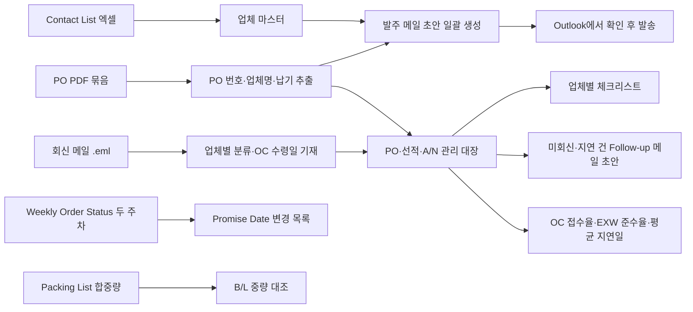

# 외자재 운영관리 Agent — 프로젝트 기획서

| 항목 | 내용 |
|---|---|
| 리포 | data09-12 |
| 제출자 | 김세이 |
| 직무·소속 | 생산관리팀 외자재 운영 — 해외 공급업체 대상 발주(PO), 납기 관리, A/N 및 선적서류 관리, 커뮤니케이션 업무 |
| 과정 | 현장 데이터 디지털화 전문가과정 1차수 |
| 작성일 | 2026-09-28 |
| 문서 상태 | 초안 v0.2 — 수강생 추가 게시물·댓글 반영 |

---

## 1. 추진 배경과 현안

외자재 운영 담당자는 해외 공급업체를 상대로 발주(PO) 발송, 납기 관리, A/N(도착 통지, Arrival Notice — 가정: 원문 약어의 일반적 의미) 및 선적서류 관리, 업체 커뮤니케이션을 함께 수행합니다.

제출 원문에 적힌 현안은 다음 다섯 가지를 한 번에 해결하는 것입니다.

1. 업체별 연락처 자동 조회
2. PO 일괄 발송
3. A/N 자동 관리
4. 업체별 체크리스트 제공
5. Follow-up 메일 자동 생성

2026-09-28 추가 댓글에서 실제 업무 흐름과 요구가 더 구체적으로 제시되었습니다.

- 업무 흐름: **PO(.pdf) 발행 → 공급사 송부 → OC(Order Confirmation) 회신 확인(누락 방지) → EXW DATE 관리**
- 발주 메일을 보낸 뒤 공급사 회신 메일을 받은 일자를 **OC 일자로 기재하고 수령 여부를 관리**합니다. 현재는 HD360 페이지에서 EXW DATE와 OC 접수율을 확인하고 있습니다.
- **OC 미접수 건 팔로우업 작업의 자동화**가 필요합니다.
- **업체별 메일 분류** 작업을 요청했습니다.
- **Cummins Weekly Order Status 엑셀**에서 Promise Date가 바뀐 건을 확인해야 합니다.
- **Packing List의 자재 합중량과 B/L 중량이 일치하는지** 확인해야 합니다.
- EXW 준수율(%)과 평균 지연일을 보이게 하는 요구도 함께 전달되었습니다(패들릿 원문에서는 문구가 확인되지 않아 수강생 확인이 필요합니다).

제출 원문의 기대 산출물에 「선적일정 누락 방지」「업체별 관리 표준화」「담당자 변경 시 업무 연속성 확보」가 적혀 있으므로, 현재는 다음 어려움이 있다고 봅니다(가정).

- 업체 연락처·PO·메일이 엑셀, PDF, Outlook에 흩어져 있어 발주 때마다 찾아 맞추는 시간이 듭니다.
- 선적 일정과 A/N 수신 여부를 사람이 기억하거나 메일함에서 확인해야 해 누락이 생길 수 있습니다.
- 업체마다 챙겨야 할 항목이 담당자 머릿속에 있어, 담당자가 바뀌면 이어받기 어렵습니다.

## 2. 목표

### 2.1 최종 목표 (제출 원문 기준)

- 발주 업무시간 80% 이상 단축
- 선적일정 누락 방지
- 업체별 관리 표준화
- 담당자 변경 시 업무 연속성 확보

### 2.2 1차 개발 목표

- 공급업체 Contact List 엑셀과 PO PDF 묶음을 브라우저에 올리면, **PO마다 업체를 찾아 수신자·참조·제목·본문이 채워진 발주 메일 초안을 일괄로 만들어 주는 도구**를 먼저 만듭니다. 담당자는 초안을 Outlook에서 열어 확인한 뒤 보냅니다(자동 발송은 하지 않음).
- 같은 화면에 PO별 송부일·OC 수령일·EXW DATE·선적·A/N 진행 상태를 기록하는 **관리 대장**을 두어, OC 미접수와 선적 누락을 한눈에 봅니다.
- OC 미접수 건 팔로우업 메일 초안, EXW 준수율·평균 지연일, Weekly Order Status의 Promise Date 변경 검출, Packing List 합중량과 B/L 중량 대조를 같은 도구 안에서 처리합니다.

## 3. 보유 데이터

| 데이터 | 형태 | 규모·주기 | 비고(민감도 등) |
|---|---|---|---|
| 공급업체 Contact List 정리본 | Excel | 업체 수·열 구성 미상(샘플 필요) | 업체 담당자 이름·이메일·전화 — 개인정보 포함 |
| 구매발주서(PO) | PDF | 발주 건마다 발생, 발행 주기·월 건수 미상 | 단가·수량·품번 등 거래 조건 — 영업 비밀 |
| 업무 메일 | Outlook 메일 | 업체 커뮤니케이션, A/N·선적서류 수신 포함(가정) | 거래처 정보 포함 — 민감 |
| A/N·선적서류 | 메일 첨부로 수신(가정), 형태 미상 | 선적 건마다 | 확인 필요 |
| OC(Order Confirmation) 회신 메일 | Outlook 메일 | PO 송부 건마다 | 회신 수신일을 OC 일자로 기재 |
| HD360 페이지의 EXW DATE·OC 접수율 | 사내(또는 포털) 웹 화면 — 내려받기 가능 여부 미상 | 수시 확인 | 확인 필요 |
| Cummins Weekly Order Status | Excel | 주간(파일명 기준, 가정) | 열 구성 미상 — PO·품번·Promise Date 포함(가정) |
| Packing List | 형태 미상(Excel 또는 PDF, 가정) | 선적 건마다 | 자재별 중량 포함 |
| B/L(선하증권) | 형태 미상(PDF, 가정) | 선적 건마다 | 총중량 기재 |

제출 원문에 첨부 파일은 없습니다. 실제 열 이름·양식은 샘플을 받은 뒤 확정합니다(10장).

## 4. 해결 방안 개요

| 단계 | 내용 |
|---|---|
| 수집 | Contact List 엑셀, PO PDF, (확장) Outlook 메일의 A/N·선적서류 |
| 정리 | 업체 마스터(업체명·코드·수신자·참조·언어·체크리스트), PO 목록(PO 번호·업체·품목·납기) |
| 분석·AI | PO PDF에서 핵심 항목 추출, 납기·선적 상태 계산, 업체·상황에 맞는 Follow-up 메일 문안 생성 |
| 산출물 | 발주 메일 초안 묶음, PO·선적·A/N 관리 대장, 업체별 체크리스트, Follow-up 메일 초안 |

## 5. 주요 기능

| 기능 | 설명 | 우선순위 |
|---|---|---|
| 업체 연락처 조회 | Contact List 엑셀을 올리면 업체명·코드로 검색해 수신자·참조·연락처를 바로 확인 | MVP |
| PO–업체 자동 매칭 | PO PDF 파일명 또는 본문에서 업체명·PO 번호를 읽어 업체 마스터와 연결, 못 찾은 건은 목록으로 표시 | MVP |
| 발주 메일 초안 일괄 생성 | PO마다 수신자·참조·제목·영문 본문·PO 첨부가 채워진 메일 파일(.eml)을 만들어 Outlook에서 열고 보내게 함 | MVP |
| PO·선적·A/N 관리 대장 | PO별 발주일, 송부일, OC 수령일, EXW DATE(약속·실제), 선적 예정일, A/N 수신 여부, 선적서류 수신 여부를 기록하고 누락·임박 건을 강조, 엑셀로 내보내기 | MVP |
| OC 수령 관리 | 공급사 회신 메일을 받은 일자를 OC 일자로 기재, 송부 후 설정한 일수가 지나도 OC가 없는 건을 「OC 미접수」로 표시, OC 접수율 계산 | MVP |
| OC 미접수 팔로우업 | OC 미접수 건을 업체별로 묶어 PO 목록이 들어간 팔로우업 메일 초안(.eml) 생성 — 자동 발송은 하지 않음 | MVP |
| EXW 준수율·평균 지연일 | 약속 EXW DATE와 실제 출고일을 비교해 준수율(%)·평균 지연일을 전체·업체별로 표시 | MVP |
| 업체별 메일 분류 | Outlook에서 저장한 메일 파일(.eml)을 올리면 발신 도메인으로 업체를 찾아 분류하고, 제목·본문의 PO 번호로 OC 수령일 기재 후보를 제시(사람이 확인 후 반영) | MVP(반자동) / 확장(메일함 직접 연동) |
| Promise Date 변경 확인 | Cummins Weekly Order Status 엑셀 두 주차를 올리면 PO·라인 기준으로 Promise Date가 바뀐 건, 새로 생긴 건, 빠진 건을 목록으로 보여 주고 엑셀로 내보내기 | MVP |
| Packing List–B/L 중량 대조 | Packing List 엑셀의 자재 중량 합계를 B/L 중량과 비교해 허용 오차를 넘으면 표시 | MVP(엑셀 Packing List + B/L 중량 입력) / 확장(PDF에서 자동 추출) |
| 업체별 체크리스트 | 업체마다 챙길 항목(필요 선적서류, 특이 요청 등)을 등록해 PO 처리 때 함께 표시 | MVP |
| Follow-up 메일 초안 | 납기 확인, 선적서류 요청, A/N 미수신 등 상황별 영문 메일 초안을 업체·PO 정보로 채워 생성 | MVP(템플릿) / 확장(생성형 AI 문안) |
| A/N 자동 관리 | 수신 메일에서 A/N·선적서류를 찾아 관리 대장에 자동 반영 | 확장 |
| 실제 일괄 발송 | 확인 버튼 한 번으로 메일 발송(Make 등) | 확장 |
| 담당자 인수인계 보기 | 업체별 이력·체크리스트·미결 건을 한 장으로 출력 | 확장 |

## 6. 기대 산출물

1. **외자재 발주 도우미(브라우저 도구)** — 업체 조회, PO 매칭, 발주 메일 초안 일괄 생성
2. **PO·선적·A/N 관리 대장** — 화면과 엑셀 내보내기
3. **업체별 체크리스트 표준 양식** — 업체 관리 표준화의 기준
4. **Follow-up 메일 템플릿 모음** — 상황별 영문 문안
5. (확장) Make 시나리오 — 메일 수신 감지 → 대장 갱신 → 미회신 알림

## 7. 기술 구성

| 과정 도구 | 이 프로젝트에서 쓰는 곳 |
|---|---|
| DAY1 암묵지 자산화·전략기획 | 업체별로 담당자가 알고 있는 주의사항을 체크리스트로 꺼내 적기 — 업무 연속성의 핵심 |
| DAY2 코랩(Python)·바이브코딩 | Contact List 정리, PO 목록과 업체 마스터 대조 |
| DAY3 멀티모달 비정형 정보화 | PO PDF·선적서류에서 PO 번호·업체·납기 등 추출 |
| DAY4 RAG (Dify, NotebookLM) | 업체별 과거 메일·체크리스트를 근거로 한 Follow-up 문안 도우미 (확장) |
| DAY5 Make 자동화 (Sheets·Gmail·OpenAI) | 메일 수신 감지 → 관리 대장 갱신, 미회신 알림, 발송 자동화 (확장) |
| 생성형 AI | 상황별 영문 Follow-up 메일 문안 |

**개발 형태(권장)**

- **설치 없이 브라우저에서 도는 정적 웹 도구**로 만듭니다. 엑셀 읽기·쓰기, PDF 텍스트 읽기, 메일 파일(.eml) 생성을 모두 브라우저 안에서 처리하므로 **업체 정보와 PO가 외부 서버로 나가지 않습니다.**
- 메일은 도구가 직접 보내지 않고 **Outlook에서 열리는 초안 파일**로 만듭니다. 사내 메일 계정 연동 없이도 바로 쓸 수 있고, 발송 전 사람이 확인하는 단계가 남습니다.
- 관리 대장은 1차에 브라우저 저장 + 엑셀 내보내기/가져오기로 보관합니다. 팀 공유가 필요하면 허용되는 저장 위치를 확인한 뒤 붙입니다.
- 과정의 Make 실습은 Gmail 기준이고 회사 메일은 Outlook입니다. 자동 발송·수신 감지는 Outlook(Microsoft 365) 연결이 사내에서 허용되는지 확인한 뒤 진행합니다(10장).

## 8. 개발 단계

### 1단계 — 지금 바로 개발 가능한 부분

제출 자료에 샘플 파일이 없으므로, **가정한 표준 양식으로 먼저 만들고 실제 파일을 받으면 열 이름 매핑만 바꾸는** 방식으로 진행합니다.

- 업체 마스터: Contact List 엑셀 가져오기(열 매핑 화면 포함), 업체 검색·조회
- PO 매칭: PO PDF 여러 개를 끌어다 놓으면 파일명·본문에서 PO 번호와 업체명을 찾아 업체 마스터와 연결
- 발주 메일 초안 일괄 생성: 업체별 수신자·참조와 표준 영문 본문으로 .eml 파일 묶음 생성(PO PDF 첨부 포함)
- 관리 대장: PO별 송부일·OC 수령일·약속/실제 EXW DATE·선적 예정일·A/N·선적서류 수신 체크, 임박·누락 강조, 엑셀 내보내기·가져오기
- OC 수령 관리: OC 수령일 기재, 설정 일수 경과 OC 미접수 표시, OC 접수율
- OC 미접수 팔로우업: 업체별로 묶은 팔로우업 메일 초안(.eml) 생성
- EXW 준수율(%)·평균 지연일: 전체·업체별 표와 막대 그래프
- 업체별 메일 분류(반자동): .eml 파일을 발신 도메인으로 업체에 분류, PO 번호가 보이는 회신은 OC 수령일 기재 후보로 제시
- Promise Date 변경 확인: Weekly Order Status 엑셀 두 파일 비교(열 매핑 화면 포함)
- Packing List 합중량과 B/L 중량 대조: Packing List 엑셀 열 매핑, B/L 중량 직접 입력, 허용 오차는 설정값
- 업체별 체크리스트 입력·표시, 상황별 Follow-up 메일 템플릿(생성형 AI 없이 빈칸 채우기)
- 판단 기준(OC 대기 일수, EXW 임박 일수, 중량 허용 오차 등)은 모두 화면에서 바꾸는 설정값으로 둡니다.

### 2단계

- 실제 Contact List·PO 샘플로 추출 규칙 보정(PO 양식이 업체·시기별로 다른지 확인 후)
- 생성형 AI로 상황·업체에 맞춘 Follow-up 문안 다듬기(외부 AI 사용 허용 시)
- 담당자 인수인계용 업체별 한 장 요약 출력
- B/L·Packing List PDF에서 중량 자동 추출(양식 확인 후)
- HD360에서 내려받을 수 있는 자료가 있으면 관리 대장 가져오기에 연결

### 3단계

- Make(또는 사내 허용 도구)로 Outlook 수신 메일에서 A/N·선적서류 감지 → 관리 대장 자동 갱신
- 미회신·지연 건 알림, 확인 후 일괄 발송
- 메일함 직접 연동으로 업체별 메일 자동 분류(Outlook 연결 허용 시)
- Dify 지식베이스에 업체별 과거 커뮤니케이션을 넣은 문의 응대 도우미

## 9. 기대 효과

- **발주 업무시간 단축** — 제출 원문의 목표는 「80% 이상 단축」입니다. 업체 조회와 메일 작성을 PO마다 반복하지 않게 되는 것이 주된 근거입니다. 실제 단축률은 도입 전후 측정이 필요합니다.
- **선적일정 누락 방지** — PO별 선적·A/N 상태가 대장 한 곳에 모이고 임박·누락 건이 강조됩니다.
- **업체별 관리 표준화** — 업체마다 체크리스트와 메일 템플릿이 정해져, 누가 처리해도 같은 기준을 따릅니다.
- **업무 연속성 확보** — 담당자가 바뀌어도 업체 마스터·체크리스트·대장이 남아 이어받을 수 있습니다.

## 10. 확인 필요 사항

**샘플 데이터 (개인정보·단가는 가려도 됩니다)**

1. 공급업체 Contact List 엑셀 샘플 — 열 구성(업체명, 업체 코드, 담당자, 이메일, 참조, 국가·언어 등)과 업체 수
2. 구매발주서(PO) PDF 샘플 2~3건 — 사내 시스템에서 출력한 텍스트 PDF인지 스캔본인지, 업체별로 양식이 같은지
3. 현재 쓰는 발주 메일, Follow-up 메일 문안 예시
4. A/N·선적서류가 어떤 형태로(메일 본문, 첨부 PDF, 포워더 시스템 등) 누구에게서 오는지

5-1. Cummins Weekly Order Status 엑셀 샘플 두 주차 — 열 이름(PO, 라인, 품번, Promise Date 등)과 한 행을 구분하는 기준
5-2. Packing List와 B/L 샘플 — 파일 형태(엑셀·PDF), 중량 단위(kg 등), 순중량·총중량 중 어느 값을 비교하는지
5-3. OC 회신 메일 예시 — 제목·본문에 PO 번호가 들어오는지, 업체 메일 도메인이 업체마다 하나인지
5-4. HD360 페이지에서 EXW DATE·OC 접수율 자료를 엑셀로 내려받을 수 있는지

**업무 규칙**

5. 「A/N」의 사내 의미(Arrival Notice로 이해했습니다)와 관리해야 할 상태 단계
6. 월 평균 PO 건수와 한 번에 일괄 발송하는 건수 — 기대 효과 측정 기준
7. 업체별 체크리스트에 들어갈 항목 예시
8. PO 번호·업체 코드가 ERP 등 사내 시스템에서 엑셀로 내려받을 수 있는지(PDF 추출보다 정확함)
8-1. OC 일자 기준 — 「회신 메일을 받은 날」로 이해했습니다. OC 문서에 적힌 일자와 다를 때 어느 값을 쓰는지
8-2. OC 미접수로 보는 기준 일수(송부 후 며칠), EXW 「준수」의 기준(당일까지 출고, 또는 허용 일수)
8-3. 중량 일치 판단의 허용 오차(kg 또는 %)
8-4. EXW 준수율·평균 지연일 요구 — 패들릿 원문에서 문구가 확인되지 않아, 필요 여부와 산식을 확인해 주십시오

**보안·환경**

9. 업체 정보·PO를 외부 AI 서비스나 클라우드(Make, OpenAI, Google Sheets)에 넣어도 되는지
10. Outlook이 Microsoft 365(웹) 계정인지, 외부 자동화 도구 연결이 허용되는지
11. 관리 대장을 팀원과 공유해야 하는지, 공유한다면 허용되는 저장 위치

## 부록. 제출 원문 요약

| 출처 | 파일·게시물 | 내용 |
|---|---|---|
| 패들릿 게시물 1 (2026-09-28T06:25) | 「외자재운영관리 Agent」 — `기획_원문.md` | 직무·소속(생산관리팀 외자재 운영), 현안 1건(연락처 자동 조회, PO 일괄 발송, A/N 자동 관리, 업체별 체크리스트, Follow-up 메일 자동 생성), 보유 데이터(Contact List 엑셀, PO pdf, outlook 메일), 기대 산출물(발주 업무시간 80% 이상 단축 등 4항목) |

| 패들릿 댓글 (게시물 1, 2026-09-28T08:21) | `패들릿_제출_원문.md` 추가 절 | 업무 흐름: PO(.pdf) 발행 → 공급사 송부 → OC 회신 확인(누락 방지) → EXW DATE 관리 |
| 패들릿 댓글 (리포 카드, 2026-09-28T08:15) | 〃 | 회신 수신일을 OC 일자로 기재·수령 관리, HD360에서 EXW DATE·OC 접수율 확인 중, OC 미접수 팔로우업 자동화, 업체별 메일 분류 |
| 패들릿 댓글 (리포 카드, 2026-09-28T08:16) | 〃 | Cummins Weekly Order Status 엑셀의 Promise Date 변경 확인 |
| 패들릿 댓글 (리포 카드, 2026-09-28T08:27) | 〃 | Packing List 자재 합중량과 B/L 중량 일치 확인 |

첨부 파일은 제출되지 않았습니다(`attachments.json` 비어 있음).
